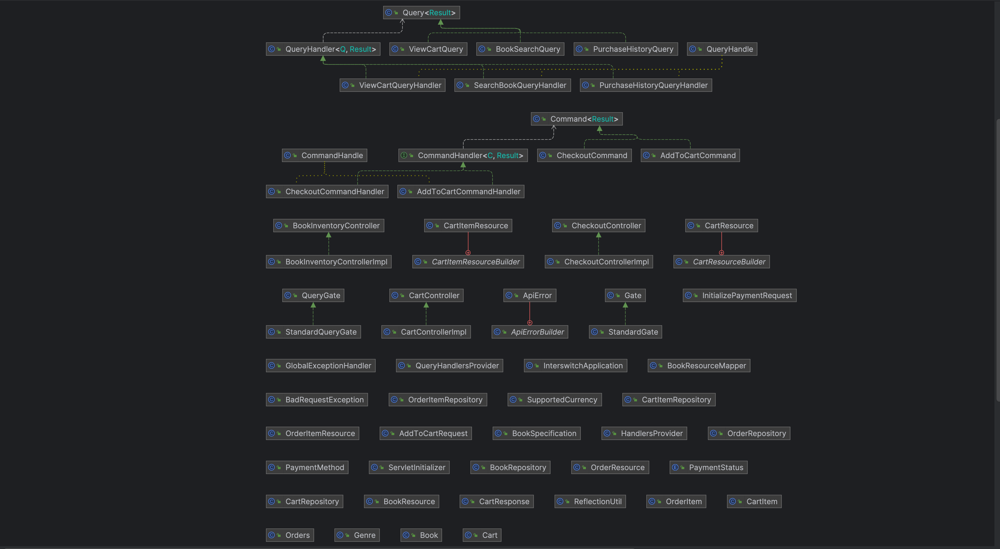
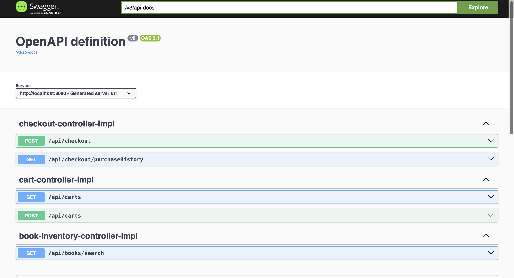
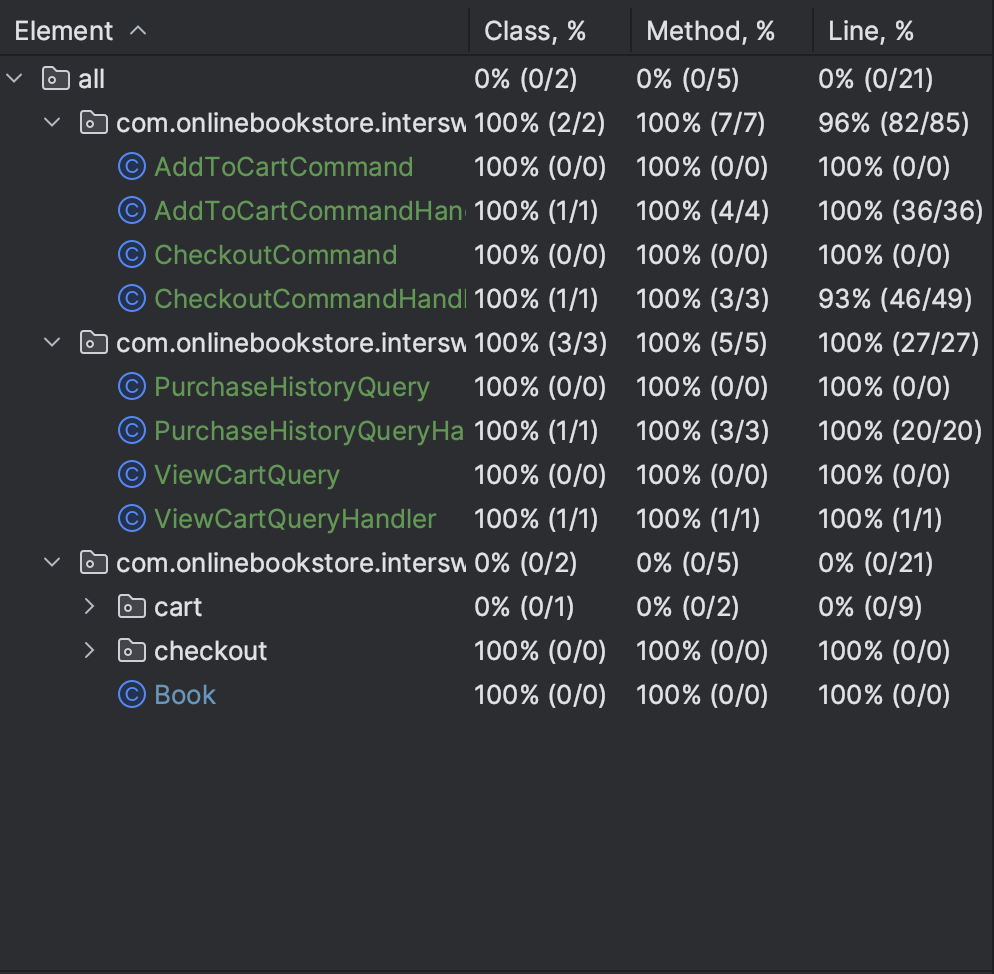

# Online Bookstore

## Project Description
This is an online bookstore application designed using **CQRS (Command Query Responsibility Segregation)** and **DDD (Domain-Driven Design)**. The system efficiently handles book inventory, carts, and checkout processes while ensuring scalability and maintainability.

## Architectural Patterns

### CQRS (Command Query Responsibility Segregation)
CQRS separates read and write operations into different models. This improves performance, scalability, and security.

### DDD (Domain-Driven Design)
DDD focuses on modeling the business domain, ensuring clear separation of concerns and business logic encapsulation.

#### High-Level Design Diagram:


## Prerequisites
- **Java Development Kit (JDK) 17**
- **Maven 4.0** (Build Tool) - [Download Maven](https://maven.apache.org/download.cgi)
- **PostgreSQL Database**

### Database Setup
Run the following command to create the database:
```sql
CREATE DATABASE BookStore;
```
Ensure PostgreSQL server is running with the default username **postgres** and no password. Migrations will run automatically when the application starts.

## Recommended IDE
- **IntelliJ IDEA** (Recommended for best development experience)

## Getting Started

### Clone the Repository
```sh
git clone git@github.com:ORC-1/5dd0a10c-5ae4-4004-885b-e32a5c29f349.git
```

### Importing the Project into IntelliJ
1. Open IntelliJ IDEA.
2. Click on **File > New > Project from Version Control**.
3. Paste the repository URL and click **Clone**.
4. Wait for dependencies to be resolved.

## Running the Application

### Command Line
```sh
mvn spring-boot:run
```

### IntelliJ
1. Open the project in IntelliJ.
2. Navigate to the **InterswitchApplication.java** file.
3. Click **Run as Spring Boot App**.
4. Or You can click the play button at the top right after dependencies has been fully resolved.

## Accessing the Application
- Swagger UI: [http://localhost:8080/swagger-ui/index.html#/](http://localhost:8080/swagger-ui/index.html#/)
- 
- Postman Collection: [API Collection](https://red-crescent-337217.postman.co/workspace/Ghabie~e22dd885-5fbf-4f0d-bb37-305d68b01615/collection/5673795-57e8bd01-dc26-401e-bcfc-91e6e1c31a63?action=share&creator=5673795)
## API Example
### Searching for Books by Genre
#### Request:
GET http://localhost:8080/api/books/search?genre=FICTION&page=0&size=10&sort=id
#### Response:
```json
{
    "content": [
        {
            "id": "2d87d900-7ef2-4503-bf56-ef90383cfd36",
            "title": "Things Fall Apart",
            "genre": "FICTION",
            "isbn": "978-0-435-90756-7",
            "author": "Chinua Achebe",
            "price": 1550.99,
            "stockQuantity": 48,
            "publicationYear": 1958
        },
        {
            "id": "47d7e92b-ca73-4280-8c93-77f7307898fa",
            "title": "Obi Goes to School",
            "genre": "FICTION",
            "isbn": "978-1-84507-479-1",
            "author": "Chukwuemeka Ike",
            "price": 1000.50,
            "stockQuantity": 40,
            "publicationYear": 1963
        },
        {
            "id": "55bc48c0-bbea-4869-b789-af946b719169",
            "title": "Whispering Pines",
            "genre": "FICTION",
            "isbn": "978-0-394-82375-5",
            "author": "Emily Bronte",
            "price": 1400.95,
            "stockQuantity": 45,
            "publicationYear": 1847
        },
        {
            "id": "7432d1a5-9173-4948-9951-e43ed5df2ab0",
            "title": "Moby Dick",
            "genre": "FICTION",
            "isbn": "978-0-14-243724-7",
            "author": "Herman Melville",
            "price": 1200.49,
            "stockQuantity": 20,
            "publicationYear": 1845
        },
        {
            "id": "feee30db-2419-44e5-8694-1a247a2c384b",
            "title": "Half of a Yellow Sun",
            "genre": "FICTION",
            "isbn": "978-0-00-720028-3",
            "author": "Chimamanda Ngozi Adichie",
            "price": 1800.49,
            "stockQuantity": 30,
            "publicationYear": 2006
        }
    ],
    "pageable": {
        "pageNumber": 0,
        "pageSize": 10,
        "sort": {
            "empty": false,
            "sorted": true,
            "unsorted": false
        },
        "offset": 0,
        "paged": true,
        "unpaged": false
    },
    "totalElements": 5,
    "totalPages": 1,
    "last": true,
    "size": 10,
    "number": 0,
    "sort": {
        "empty": false,
        "sorted": true,
        "unsorted": false
    },
    "numberOfElements": 5,
    "first": true,
    "empty": false
}
```
## Testing

### Running Unit Tests in IntelliJ
1. Open IntelliJ IDEA.
2. Navigate to **Run > Run Tests**.
3. All tests should pass successfully.

All key functionalities have **100% unit test coverage**.

#### Test Coverage Report:

